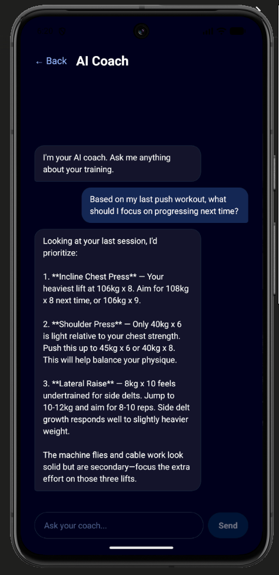
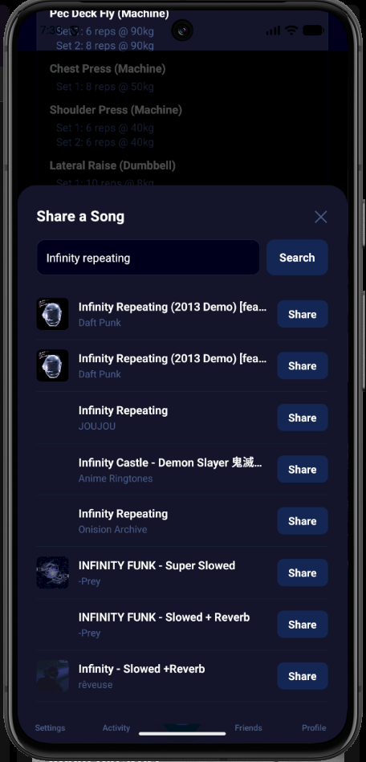
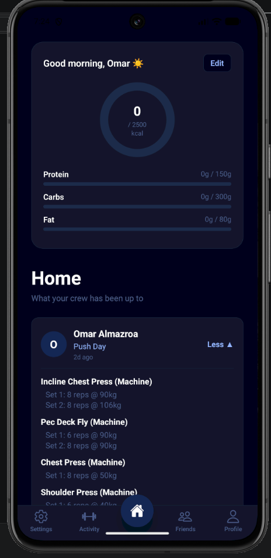

# GymSync

A social fitness-tracking mobile app built with React Native and Expo. Log workouts, track calories, share songs with your training crew, and get personalized coaching from an AI that reads your own training history.

## Features

- **AI Coach** — Chat with an AI fitness coach that reads your training split and recent workouts to give specific, personalized advice on progression and programming. Powered by the Anthropic Messages API (Claude Haiku 4.5).
- **Workout Tracking** — Log exercises, sets, reps, and weights against a customizable training split (PPL, Upper/Lower, or custom).
- **Calorie & Macro Tracking** — Daily calorie ring with protein, carbs, and fat progress bars.
- **Social Feed** — Share songs you're training to via Spotify integration; see what your crew is lifting to.
- **Friends & Groups** — Follow friends, form training groups, compare progress.

## Tech Stack

- **Frontend:** React Native, Expo SDK 54
- **Backend / Data:** Firebase (Authentication, Firestore)
- **AI:** Anthropic API (Claude Haiku 4.5)
- **Integrations:** Spotify Web API

## Screenshots

### AI Coach — Context-Aware Fitness Coaching
The AI Coach reads the user's training split and recent workouts from Firestore, then injects that context into the system prompt so replies reference actual exercises and weights. Powered by the Anthropic Messages API.



### Spotify Integration — REST API Consumption
Real-time search against the Spotify Web API. Users search for a track, see live results with album art and artist metadata, and share to the crew feed.



### Home
Daily calorie tracking, macro breakdown, and social feed of friends' recent workouts.



## REST API Integration

The AI Coach demonstrates integration with the Anthropic Messages API:

- **Endpoint:** `POST https://api.anthropic.com/v1/messages`
- **Auth:** API key via `x-api-key` header
- **Request:** JSON body with model, system prompt (dynamically built from Firestore data), and conversation history
- **Response handling:** JSON parsing, error states (network failures, non-200 responses), and typing indicators during async waits

Additional REST integrations: Spotify Web API (OAuth + track search), Firebase Firestore (user data, workouts, social graph).

## Running Locally

```bash
git clone https://github.com/OmarMz70/GymSync.git
cd GymSync
npm install
cp .env.example .env  # then add your own Anthropic API key
npx expo start
```

## About

Built by Omar Al-Mazroa — Information Systems student at Imam Mohammad Bin Saud Islamic University, Riyadh. Exploring AI engineering and applied ML.